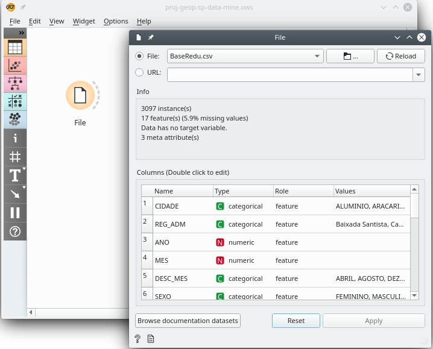
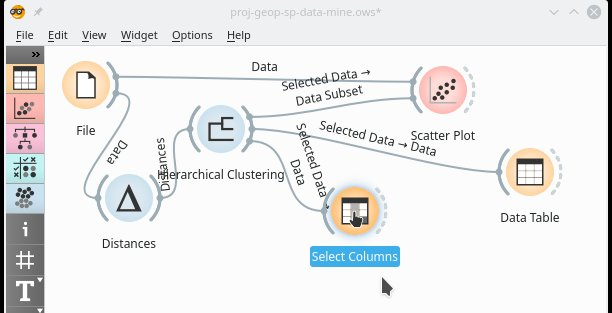
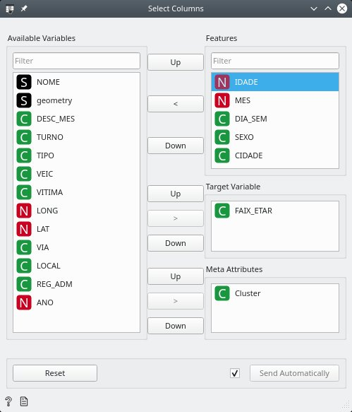

# Projeto de Mineração de Dados - CAP359

Tema: Explorando um banco de dados de acidentes de trânsito

<sub>Última revisão: 2019-12-24</sub>

# Resumo

Neste experimento será explicado o que foi feito como projeto na disciplina CAP-359 (Princípios e Aplicações de Mineração de Dados) no Programa de Pós-Graduação em Computação Aplicada no Instituto Nacional de Pesquisas Espaciais. Este trabalho procura responder algumas questões formuladas referentes à Base de Dados Infosiga de acidentes de trânsito, de forma interativa utilizando Python e Orange, com o objetivo de analisar e processar os dados sob diferentes perspectivas, buscando padrões, consistências e relacionamentos com outros dados, e obtendo informações para se possível, contribuir com ações ou decisões para reduzi-los ou evitá-los. O resultado do estudo mostrou-se satisfatório, e a maioria das questões puderam ser respondidas, abrindo caminho para um melhor entendimento do tema.

# Sumário

<!--ts-->
   * [Projeto de Mineração de Dados - CAP359](#projeto-de-mineração-de-dados---cap359)
   * [Resumo](#resumo)
   * [Sumário](#sumário)
   * [Introdução](#introdução)
   * [Dados](#dados)
      * [Banco de dados de acidentes](#banco-de-dados-de-acidentes)
      * [Banco de dados do OpenStreetMap](#banco-de-dados-do-openstreetmap)
   * [Pré-processamento](#pré-processamento)
      * [Principais ferramentas utilizadas](#principais-ferramentas-utilizadas)
      * [Seleção e transformação dos dados](#seleção-e-transformação-dos-dados)
   * [Experimentos](#experimentos)
      * [Perguntas a respeito dos dados](#perguntas-a-respeito-dos-dados)
      * [Lendo o <em>dataset</em>](#lendo-o-dataset)
      * [Visualizando](#visualizando)
   * [Resultados e Considerações Finais](#resultados-e-considerações-finais)
   * [Referências](#referências)
<!--te-->

# Introdução

A [Base de Dados Infosiga SP](http://www.infosiga.sp.gov.br/Home/InfoMapaRelatorio) é um sistema mantido pelo governo do Estado de São Paulo, através do programa Movimento Paulista de Segurança no Trânsito, e contém um banco de dados com informações de acidentes de trânsito para os 645 municípios do estado, com várias informações relativas a quantidade de fatalidades e perfil dos acidentes e vítimas. Através da análise destes dados usando Python e Orange tentaremos responder a perguntas propostas, buscando padrões e relações com o objetivo de entender melhor a dinâmica dos acidentes e outras informações relevantes, para que possam ser melhor compreendidos, esperando que estas informações sirvam de alguma forma para reduzi-los ou evitá-los.

# Dados

## Banco de dados de acidentes

O arquivo "BaseCompletaNov17.csv" contem informações de acidentes de 2016 a 2017, possui 2,4 MB e 16904 registros no formato CSV (separados por ponto e vírgula). Está disponível para download em

- www.infosiga.sp.gov.br/Home/BuscarInfoMapaRelatorioPorId/58

Os dados são mostrados na figura a seguir, carregados em uma planilha, para termos uma visão geral ajudando a identificar as primeiras características do banco


Olhando mais de perto a planilha acima, já podemos identificar algumas características e padrões dos dados que nos ajudará nos passos seguintes, como por exemplo se todos os campos estão completos, qual é o formato do campo Faixa Etária, o formato dos números, e assim por diante


Descrição das colunas (atributos)

| COLUNA (ATRIBUTO)      | DESCRIÇÃO                                                    |
| ---------------------- | ------------------------------------------------------------ |
| Cidade Considerada     | Nome da cidade                                               |
| Região Administrativa  | Região Metropolitana, Baixada Santista, nome da cidade que administra |
| Ano Óbito              | Ano do acidente                                              |
| Mês Óbito              | Mês do acidente                                              |
| Mês Descrição          | Nome do mês do acidente                                      |
| Sexo                   | Masculino, Feminino                                          |
| Turno                  | Madrugada, Noite, Manhã, Tarde                               |
| Tipo Acidente          | Colisão, Atropelamento, Choque, Outros                       |
| Tipo Veiculo           | Motocicleta, Automóvel, Pedestre, Bicicleta                  |
| Faixa Etária           | 30-34, 25-29, 45-49, 65-69, ...                              |
| Idade                  | Idade da vítima                                              |
| Tipo Vítima            | Condutor, Passageiro, Pedestre                               |
| Tipo Local do Acidente | Publico, Privado                                             |
| Dia Semana             | Nome do dia da semana                                        |
| Tipo de Via            | Municipal, Rodovia, ....                                     |
| LAT_(geo)              | Latitude, ex.: -23,55566                                     |
| LONG_(geo)             | Longitude, ex.: -46,823586                                   |
| Rua / Rodovia          | Nome da via                                                  |

Exemplo de um registro:  11400

| COLUNA (ATRIBUTO)      | REGISTRO 11400             |
| ---------------------- | -------------------------- |
| Cidade Considerada     | DIADEMA                    |
| Região Administrativa  | Metropolitana de São Paulo |
| Ano Óbito              | 2016                       |
| Mês Óbito              | 12                         |
| Mês Descrição          | DEZEMBRO                   |
| Sexo                   | MASCULINO                  |
| Turno                  | MADRUGADA                  |
| Tipo Acidente          | ATROPELAMENTO              |
| Tipo Veiculo           | PEDESTRE                   |
| Faixa Etária           | 25-29                      |
| Idade                  | 26                         |
| Tipo Vítima            | PEDESTRE                   |
| Tipo Local do Acidente | PUBLICO                    |
| Dia Semana             | DOMINGO                    |
| Tipo de Via            | Vias Municipais            |
| LAT_(geo)              | -23,731938                 |
| LONG_(geo)             | -46,620164                 |
| Rua / Rodovia          | AVENIDA AFRÂNIO PEIXOTO    |

## Banco de dados do OpenStreetMap

Como o OpenStreetMap não é o foco principal desse estudo não entraremos em detalhes, ele vai apenas ajudar na visualização dos dados, compondo um mapa de fundo de vias para auxiliar na localização das regiões, visualização da quantidade de acidentes em vias, e ajudar em informações visuais que podem ser obtidas sobrepondo os pontos dos acidentes a um mapa de fundo de vias. Maiores informações sobre o OpenStreetMap podem ser obtidas no *site* [OpenStreetMap](https://www.openstreetmap.org/) .

Uma compilação do banco de dados de vias públicas extraído do OpenStreeMap  (Imposm GoJSON, 116 MB) pode ser obtido em:

- http://www.nextzen.org/metro-extracts/index.html , ou
- http://s3.amazonaws.com/metro-extracts.nextzen.org/sao-paulo_brazil.imposm-geojson.zip

Após baixar e extrair o arquivo `sao-paulo_brazil_roads_gen1.geojson` (16,3 MB), se obtém um arquivo que pode ser lido pelo Geopandas, como mostra a figura abaixo


Esse banco é usado junto com o Geopandas e Matplotlib para criar um mapa de fundo. Na seção de seleção e transformação de dados temos um exemplo de uso. Aqui mais uma vez não entraremos em detalhes por não ser o foco principal do estudo.

# Pré-processamento

Como os dados originais possuem algumas informações que não vamos utilizar, utilizaremos o pré-processamento para removê-las. Também vamos reorganizar o banco de forma a facilitar o manuseio e ajudar na obtenção dos resultados.

A figura a seguir mostra alguns processamentos que serão feitos nas próximas seções com maiores detalhes. O banco da esquerda é o original baixado da Infosiga, e o da direita mostra alguns processamentos já feitos.


O rearranjo da coluna `NOME` e `geometry` é opcional e pode eventualmente ajudar em alguma operação automática do Orange, dependendo do *widget* e do resultado que se deseja. Como é uma operação relativamente fácil de se realizar, pode-se optar por ir testando as versões realocadas e visualizar o resultado no Orange. Outra forma de fazer é usar os recursos do próprio Orange para isso, ao invés de realocar.

## Principais ferramentas utilizadas

- [Orange](<http://orange.biolab.si>) - pacote de ferramentas para análise de fluxo de dados interativa, de código aberto, sem necessidade de programação, com aplicações em aprendizado de máquina e mineração de dados, entre outras. Usado para explorar o conjunto de dados ("*dataset*").
- [Python]() - linguagem de programação de *script*, usada para preparar o banco de dados.
- [Numpy](http://numpy.org/) - biblioteca Python usada principalmente para realizar cálculos em *arrays* multidimensionais.
- [Pandas](http://pandas.pydata.org/) - biblioteca Python usada para estruturas de dados e ferramentas de análise.
- [Geopandas](http://geopandas.org/) - biblioteca Python usada para trabalhar com dados geoespaciais.
- [Matplotlib](http://matplotlib.org/) - biblioteca Python para produzir figuras e gráficos.
- Planilha e Editor de Texto - para visualizar arquivos identificando características gerais e padrões, pré-processamento, e para preparar dados para seleção.

## Seleção e transformação dos dados

Foi selecionada uma área em torno da região metropolitana de São Paulo com o objetivo de, em uma primeira etapa, reduzir o tamanho do banco de dados para aumentar a rapidez de acesso, processamento, e obtenção de resultados. Nesta etapa, dados que são são necessários serão eliminados para poder focarmos nas informações relevantes. Em estudos futuros pode-se aumentar a área, selecionar outras, ou então uma combinação de ambos, em função dos resultados que se pretende obter, utilizando a primeira etapa como referência. O *dataset* resultante é salvo em um arquivo do tipo CSV com o nome "BaseRedu.csv". Ele estabelece a seleção de parâmetros de dados que serão necessários, requisitados, e utilizados nos próximos passos.

Para fazer a seleção e transformação utilizamos Python e bibliotecas. O código está disponível também no arquivo tipo ".ipynb" do Jupyter Notebook

- https://github.com/efurlanm/359/blob/master/proj-geop-sp-data-mine.ipynb

Começamos carregando as bibliotecas utilizadas

```python
import pandas as pd              # pandas.pydata.org
import geopandas as gpd          # geopandas.org
import matplotlib.pyplot as plt  # matplotlib.org
import numpy as np               # numpy.org
import json                      # docs.python.org/3/library/json.html
from pathlib import Path         # docs.python.org/3/library/pathlib.html
import time                      # docs.python.org/3/library/time.html

# pypi.org/project/Shapely
# Manipulation and analysis of geometric objects in the Cartesian plane
#    conda install -c conda-forge shapely
import shapely.geometry as sg
```

Definimos algumas variáveis de ambiente e os sistemas de coordenadas

```python
# Set the environment
DirData     = Path('data')
CrashData   = Path('BaseCompletaNov17.csv')
ReduData    = Path('BaseRedu.csv')

# World Geodetic System coordinate system.
WGS84 = {'init': 'epsg:4326'}

# Web Mercator (WGS84/Pseudo-Mercator) coordinate system.
# Used by major online map providers, including Google Maps,
#   Mapbox, Bing Maps, OpenStreetMap, Mapquest, Esri, and others.
# <https://en.wikipedia.org/wiki/Web_Mercator_projection>
WM = {'init': 'epsg:3857'}
```

O arquivo original é lido e colocado na variável `f`. Os nomes das colunas são alterados para agilizar a manipulação ao longo do estudo e evitar eventuais problemas com acentos e espaços. As colunas de latitude e longitude são alteradas mudando a vírgula decimal para ponto, para usar com as bibliotecas e sintaxe Python, e finalmente as linhas com latitude inválida são eliminadas

```python
# Filter crash data and save to (smaller) file
path = DirData/CrashData
f = pd.read_csv(path,
                sep=';',
                decimal=',',
                encoding='ISO-8859-15',
                low_memory=False,
                error_bad_lines=False
               )

# Rename columns
f = f.rename(columns={
    'Cidade Considerada':'CIDADE',
    'Região Administrativa':'REG_ADM',
    'Ano Óbito':'ANO',
    'Mês Óbito':'MES',
    'Mês Descrição':'DESC_MES',
    'Sexo':'SEXO',
    'Turno':'TURNO',
    'Tipo Acidente':'TIPO',
    'Tipo Veiculo': 'VEIC',
    'Faixa Etária':'FAIX_ETAR',
    'Idade':'IDADE',
    'Hora Acidente':'HORA',
    'Tipo Vítima':'VITIMA',
    'Tipo Local do Acidente':'LOCAL',
    'Dia Semana':'DIA_SEM',
    'Tipo de Via':"VIA",
    'LAT_(geo)':'LAT',
    'LONG_(geo)':'LONG',
    'Rua / Rodovia':'NOME'
    })

# Reformat column - str to float  (WGS84)
f['LAT'] = ( f['LAT'].str.replace(',','.')
                     .apply(pd.to_numeric, errors='coerce')
           )
f['LONG'] = ( f['LONG'].str.replace(',','.')
                       .apply(pd.to_numeric, errors='coerce')
            )

# Delete NaN lines
f = f[ ~np.isnan(f['LAT']) ].copy()
```

Uma amostra do resultado é visto na figura a seguir


Conforme explicado no início da seção, para reduzir o tamanho do banco, selecionamos uma região de estudo entre as longitudes -47.4 e -45.7, e latitude abaixo de -23.1 (WGS84). Esta região compreende a região metropolitana de São Paulo e adjacências. O filtro é colocado na variável `f2`

```python
# Filter crashes and drop bad locations
# drop the outside map region
cond  = (f['LAT'] < -23.1)
cond &= (f['LONG'] > -47.4)
cond &= (f['LONG'] < -45.7)

# if desired is possible to filter even more
# drop: PEDESTRE|NAO DISPONIVEL|BICICLETA|ATROPELAMENTO|OUTROS
# cond &= f['VEIC'].str.contains(
#    r'AUTO|CAMI|MOTO|ONIB'
#    )

# Filter
f2 = f[ cond ].copy()
```

Criamos uma nova coluna  usando o Geopandas, contendo a geometria *GeoDataFrame* das coordenadas, no sistema *Web Mercator*, e na sequência gravamos o banco em um arquivo para uso posterior. Na variável `geom` colocamos as coordenadas usando a biblioteca Shapely. Na variável `crashes`  colocamos `f2` acrescentado da coluna `geometry`  contendo as coordenadas `geom`, usando o Geopandas. A coluna `geometry` de `crashes` é convertida para o sistema Web Mercator para auxiliar futuramente em eventuais cálculos de comprimentos e distâncias. E finalmente a variável `crashes` contendo o banco é gravada em um arquivo para uso posterior

```python
# Convert to GeoDataFrame

# prepare to create column geometry
geom = [sg.Point(p) for p in zip(
    f2['LONG'],    # X = easting = long
    f2['LAT']      # Y = northing = lat
    )]

# join the column
crashes = gpd.GeoDataFrame(f2, crs=WGS84, geometry=geom)

# Convert to WM
print('Is the current CRS WGS84?', crashes.crs == WGS84)
crashes = crashes.to_crs(WM)
print('Is the new CRS WM?', crashes.crs == WM)

# Save
path = DirData/ReduData
crashes.to_csv(path, index=False)
```

Esta versão do *dataset*  pré-processado está disponível em

- <http://github.com/efurlanm/359/blob/master/data/BaseRedu.csv>

**Visualização do banco de acidentes usando um mapa de fundo**

O *GeoDataFrame*  acima serve para por exemplo plotar as coordenadas dos acidentes utilizando um mapa de fundo gerado a partir do OpenStreetMap, facilitando a visualização e identificação, como mostra a figura a seguir


O recurso de mapa de fundo acima nos mostra informações adicionais como acidentes (pontos vermelhos) ao longo de estradas (linhas escuras). É possível também identificar com maior clareza a região do litoral de São Paulo, assim como estradas onde não foram registrados acidentes. Também é possível visualizar e identificar com mais detalhes a região metropolitana de São Paulo e adjacências, além de ser possível observar uma série de outras informações visuais. E como o *GeoDataFrame* usa o sistema *Web Mercator*, é possível calcular distâncias, por exemplo, se desejado. Mais uma vez aqui não entraremos em detalhes pois esse não é o nosso foco principal.

Para gerar a figura acima, usamos o código a seguir

```python
# Load roads as GeoDataFrame
path = DirData/RoadGeod    # 50 m tolerance (? need check)
roads = gpd.read_file(str(path))
# Clean column osm_id
roads['osm_id'] = ( roads['osm_id']
                      .astype(int)    # cut fractional part
                      .astype(str)    # convert to string
                  )
roads = roads.to_crs(WM)
# Plot crashes on roads
fig, ax = plt.subplots(1, figsize=(12, 12))
base = roads.plot(color='black', ax=ax)
crashes.plot(ax=base, marker='o', color='red', markersize=50)
# Display
plt.show()
```

**Google Docs**

Como o Orange possui o recurso de leitura dos dados diretamente a partir do Google Docs, podemos utilizá-lo também. Aqui removemos as linhas que contém dados não disponíveis, e podemos eventualmente mover (realocar) as colunas `NOME` e `geometry` para facilitar a visualização ou a seleção de colunas no Orange, ou dependendo do *widget* e da operação, colocando colunas principais mais à esquerda pode fazer com que o Orange as selecione automático. Mas isso pode depender do que se deseja e de como usar o Orange. Outra opção seria usar o *widget* *Rank* para selecionar os dados. A melhor solução talvez seja ir testando e visualizando no Orange até encontrar o que se deseja, uma vez que o Orange economiza vários passos e permite testar facilmente as várias configurações.


O *dataset* final contém 2920 registros com informações como nome da rua, cidade, faixa etária, tipo de acidente, e long/latid, dentre outras, e neste caso específico como está hospedado no Google Docs, "não ocupa espaço" (tem armazenamento ilimitado).

Caso se opte pela realocação das colunas, uma possível configuração seria:

COLUNA | DESCRIÇÃO
-|-
NOME | Nome da via
geometry | Coordernadas (Geopandas)
CIDADE | Nome da cidade
REG_ADM | Região metropolitana, Baixada santista, Sorocaba, SJC, etc.
ANO | 2016 ou 2017
MES | Número do mês
DES_MES | Nome do mês
SEXO | Feminino, Masculino
TURNO | Manhã, noite, etc.
TIPO | Atropelamento, colisão, etc.
VEIC | Pedestre, Motocicleta, etc.
FAIXA_ETAR | Faixa etária
IDADE | Idade
VITIMA | Pedestre, condutor, etc.
LOCAL | Publico, privado
DIA_SEM | Dia da semana
VIA | Rodovia, via municipal
LAT | Latitude
LONG | Longitude

​    

# Experimentos

## Perguntas a respeito dos dados

1. Qual é a faixa etária com maior quantidade de acidentes?
2. Qual é a distribuição de acidentes por faixa etária e por localização (longitude)?
3. Quais são os locais (vias ou coordenadas) aonde acontecem a maior quantidade de acidentes com idosos?
4. Quais são as vias mais perigosas na região de SJC?
5. Na região de SJC existe uma faixa etária que está menos sujeita a acidentes?
6. Na faixa etária de 80-99, na região de SJC, quais são os dia da semana mais perigosos?
7. Na faixa etária de 80-99, na região de SJC, quem se acidenta mais, homens ou mulheres?
8. Qual é o mês com mais acidentes?
9. Qual é o dia da semana com a maior quantidade de acidentes?
10. Qual é a faixa etária com mais acidentes no mês com mais acidentes?
11. É possível identificar algum padrão quando a vítima é mulher?
12. Quais são os locais ou vias com a maior quantidade de acidentes no Estado de São Paulo?
13. Quais são os tipos de veículos com mais acidentes?
14. Quais são os tipos de condutores com mais acidentes?
15. Quais são as principais casualidades por tipo de via?
16. A maioria dos acidentes ocorre em ruas ou rodovias?
17. Quais são as vias mais perigosas à noite?
18. Qual é o tipo de via mais perigosa para motociclistas?

Nota: nem todas estas questões podem ser respondidas, pode ser que algum dado necessário esteja faltando, incertezas, imprecisão, etc.. De qualquer forma elas ajudam a dar direção para melhores perguntas.   

## Lendo o *dataset*

Primeiro o *dataset* será lido e em seguida o Orange será utilizado para visualizar os dados, selecionar, e começar a responder algumas perguntas. O arquivo Orange tipo ".ows" com o processamento descrito abaixo está disponível em:

- https://github.com/efurlanm/359/blob/master/proj-geop-sp-data-mine.ows

Conectando o Orange ao arquivo "BaseRedu.csv"




## Visualizando

Vamos visualizar os dados para verificar se são necessárias alterações e também se foi corretamente lido conforme desejado. Começamos criando um *widget* para abrir o arquivo


Podemos optar por ler um arquivo em disco


Ou então utilizar um link do Google Docs. Neste caso o Orange faz a conexão e o download


Orange usando dados do Google Docs na web


Depois usamos o *widget* *Data Table* para ver o conteúdo do arquivo na forma de tabela


Neste caso acima a quantidade de registros no banco de dados é 3097. Uma vez definido os *widgets* e as relações entre eles, podemos alterar o nosso banco de dados, acrescentando ou retirando registros, e o Orange fará a leitura e processará de forma automática. Isso nos dá uma certa flexibilidade para ir fazendo eventuais simulações diretamente no banco de dados, tirando ou acrescentando certos dados.

Uma vez lido o banco de dados, usamos o *widget* *Scatter*, escolhendo *Show color regions*, e procuramos projeções informativas com "Find Informative Projections"


No gráfico resultante abaixo podemos distinguir faixas etárias por cor. No eixo *x* temos as idades e no eixo *y* a longitude que nos dá uma ideia aproximada de localização. Um dos principais padrões que se pode identificar no gráfico com certa facilidade, é até bastante conhecido, a faixa etária dos acidentes acontecem na região central do gráfico, tendendo aos mais jovens a partir dos 18 anos.


Usando o algoritmo *Hierarchical Clustering* é possível mostrar grupos de itens, de tipos arbitrários, em uma matriz de distâncias. Em *clustering* podemos identificar, por exemplo, acidentes com idosos em um determinado local, no caso em Peruíbe, sendo a maioria de sexo feminino, em meses próximos (agosto, setembro), e na mesma avenida


Usando o recurso de *clustering* e seleção de sub-conjuntos, com atualização automática e visualização no *scatter*. Aqui percebe-se que o sub-conjunto de idosos selecionado no *clustering* aparece como bolas cheias marrons e azuis no *scatter*, e como estão localizados em Peruíbe, aparecem próximos na mesma coordenada de longitude (eixo y). Utilizando estes recursos é possível responder perguntas de forma interativa como "Quais são os locais (ruas e coordenadas) aonde acontecem a maior quantidade de acidentes com idosos?" e "Quais as vias mais perigosas para idosos". Neste caso verifica-se que é a cidade de Peruíbe e não há uma via específica


Selecionando o cluster "C1" no *widget* *clustering* que está na região de SJC (é possível observar pela longitude no *widget* *scatter*), os outros *widget* são atualizados automaticamente. No caso é possível responder a pergunta de que se existe alguma faixa etária que não está sujeita a acidentes, e a resposta é não - todas as faixas estão sujeitas


Olhando no *widget* *table view* e clicando na coluna NOME para ordená-la, é possível responder a pergunta "qual é a via mais perigosa da região"


Usando o recurso de selecionar as colunas que se quer visualizar



O Orange já faz uma pré-seleção das colunas



Usando mais um *widget* *data table* é possível responder mais duas perguntas, quais são os dias da semana mais perigosos, e quem se acidenta mais. No caso é terça-feira e os homens se acidentam mais


No *widget* *columns* selecionando as colunas MES e FAIX_ETAR, e acrescentando o *widget* *Distributions*, podemos responder mais duas perguntas, qual o mês com mais acidentes e qual a faixa etária. No caso, o mês é dezembro e a faixa 18-24


Vamos agora tentar identificar algum padrão para quando a vítima é mulher, para tentar responder mais uma pergunta. Começamos com mais um ramo na nossa árvore, acrescentando os widgets *Logistic Regression*, *Random Forest*, *Test and Score*, e *Confusion Matrix* 


[*Logistic Regression*](http://docs.biolab.si/3/visual-programming/widgets/model/logisticregression.html) é um algoritmo de classificação aonde as entradas são o conjunto de dados e o método de pré-processamento, e as saídas são o algoritmo de aprendizado, o modelo de treinamento, e os coeficientes de regressão. Em estatística, o [modelo logístico](http://en.wikipedia.org/wiki/Logistic_regression) é usado para modelar várias classes de eventos como por exemplo se uma imagem contém ou não um determinado objeto.

[*Random Forest*](http://docs.biolab.si/3/visual-programming/widgets/model/randomforest.html) é um algoritmo de aprendizado usando [combinação de árvores de decisão](http://en.wikipedia.org/wiki/Random_forest) usado para classificação, regressão, e outras tarefas. Usa como entrada o conjunto de dados e o modelo de pré-processamento, e as saídas são o algoritmo e o modelo de treinamento.

[*Test and Score*](http://orange.biolab.si/categories/test-and-score/) é usado para avaliar a performance de modelos. Por exemplo na figura abaixo, *Logistic Regression* e *Random Forest* trabalham em conjunto com *Test and Score*, e usam validação cruzada para mostrar as informações. Primeiro ele divide os dados em dez subconjuntos, usa nove para treinar o modelo, e um para testá-lo. Então repete esse processo mais nove vezes, e em cada uma das vezes usa um subconjunto diferente para teste. As descrições das colunas da figura abaixo são:

- AUC - Área Debaixo da Curva, quanto maior melhor o modelo consegue distinguir as classes
- CA - mostra a precisão da classificação que relata a proporção de dados classificados corretamente
- F1 - peso da média de *Precision* e *Recall*
- Precision - habilidade do classificador de não classificar como positivo uma amostra que é negativa
- Recall - habilidade do classificador de encontrar todas as amostras positivas


Na figura acima vemos que o modelo *Logistic Regression* traz melhores resultados que *Random Forest*, pois AUC, CA, F1, Precision, e Recall, são melhores.

[*Confusion Matrix* ](http://orange3.readthedocs.io/projects/orange-visual-programming/widgets/evaluate/confusionmatrix.html) mostra as quantidades ou proporções entre classes previstas e o real. Como entrada ele recebe os resultados dos testes de classificação de algoritmos, e a saída é uma seleção de dados e informações adicionais sobre instâncias de dados. Simplificadamente, com ele podemos ver de uma fora fácil os erros e acertos dos modelos, e avaliá-los.

Olhando matriz de confusão da figura abaixo, para *Logistic Regression* podemos observar que a classificação para mulheres traz proporcionalmente muitos erros de classificação, quando comparado com a predição para homens. Os campos "NAO DISPONIVEL" do banco são campos sem informação


No caso de *Random Forest* a predição manteve-se aproximadamente igual, com muitos erros de predição para mulheres


Agora vamos dar uma olhada no *widget* *scatter* que pega dados do *Test and Score* e nos mostra os resultados das predições dos algoritmos de teste de classificação. Clicando em "Find Informative Projections" encontramos o gráfico abaixo de *Logistic Regression(FEMININO)* no eixo *x* e *Random Forest(FEMININO)* no eixo *y* . Podemos observar que usando os dois modelos é possível identificar um padrão com o acúmulo de pontos vermelhos (classe HOMENS) na parte inferior esquerda, e o de pontos azuis (classe FEMININO) na parte superior direita. Então respondendo a pergunta "É possível identificar algum padrão quando a vítima é mulher?", usando este gráfico e dois modelos , sim, é possível identificar um padrão, homens mais à esquerda deste gráfico, e mulheres mais à direita


No gráfico acima, selecionando (em amarelo) os pontos azuis no canto superior direito e olhando o que acontece no *widget* *data table* conectado ao *scatter*, a princípio não seria possível identificar nada mais relevante, a não ser talvez que a maioria dos acidentes ocorre na cidade de São Paulo


# Resultados e Considerações Finais

Neste estudo foi analisado o banco de dados Infosiga de acidentes de trânsito sob diferentes perspectivas, buscando padrões  e relacionamentos, para contribuir, se possível, com informações para eventuais decisões ou ações para reduzi-los ou evitá-los. Durante a análise foi possível responder à maioria das perguntas de forma interativa, e o resultado mostrou-se satisfatório. As perguntas respondidas abrem caminho para um melhor entendimento dos acidentes. Usando o Orange de forma interativa fica fácil usar  *widgets* para ir acrescentando, tirando, ou modificando o fluxo de informações até obter-se o resultado desejado. Como o número de combinações de recursos é grande,  poderíamos continuar acrescentando *widgets* para obter mais e mais informações, e responder mais perguntas conforme desejado. O *widget* *scatter* usando *Logistic Regression(FEMININO)* X *Random Forest(FEMININO)* mostra a flexibilidade desse sistema. De uma forma fácil e relativamente rápida pode ser extraída informação sobre acidentes com mulheres, utilizando dois algoritmos prontos disponíveis no Orange, sem necessidade de programação. 

Como sugestão para trabalhos futuros, pode-se acrescentar mais perguntas e tentar respondê-las, aumentando o conhecimento sobre o tema. Também poderíamos aumentar a área de estudo, abrangendo todo o Estado de São Paulo.

# Referências

**Cabspotting Data EDA**. Disponível em: <http://www.lac.inpe.br/~rafael.santos/Docs/CAP394/Proj_Cabspotting.html>. 

**CAP394 Projeto de Curso - efurlanm**. Disponível em: <https://github.com/efurlanm/394>. 

**GeoPandas**. Disponível em: <http://geopandas.org/>. 

**Infosiga - Respeito à Vida**. Disponível em: <http://www.infosiga.sp.gov.br/Home/InfoMapaRelatorio>. 

**Lattes CVs Database**. Disponível em: <http://www.lac.inpe.br/~rafael.santos/Docs/CAP394/Proj_Lattes.html>. 

**Nextzen Metro Extracts**. Disponível em: <https://www.nextzen.org/metro-extracts/index.html>. 

**NumPy**. Disponível em: <https://numpy.org/>. 

**OpenStreetMap**. Disponível em: <https://www.openstreetmap.org/>.

**Orange Data Mining**. Disponível em: <http://orange.biolab.si/>. 

**Pandas: Python Data Analysis Library**. Disponível em: <https://pandas.pydata.org/>. 

**Python**. Disponível em: <https://www.python.org/>. 

RAICHEV, A. **Introducing GeoPandas**. Disponível em: <https://pyvideo.org/kiwi-pycon-2017/introducing-geopandas.html>. 